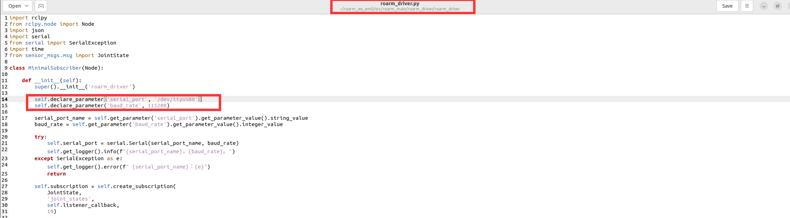
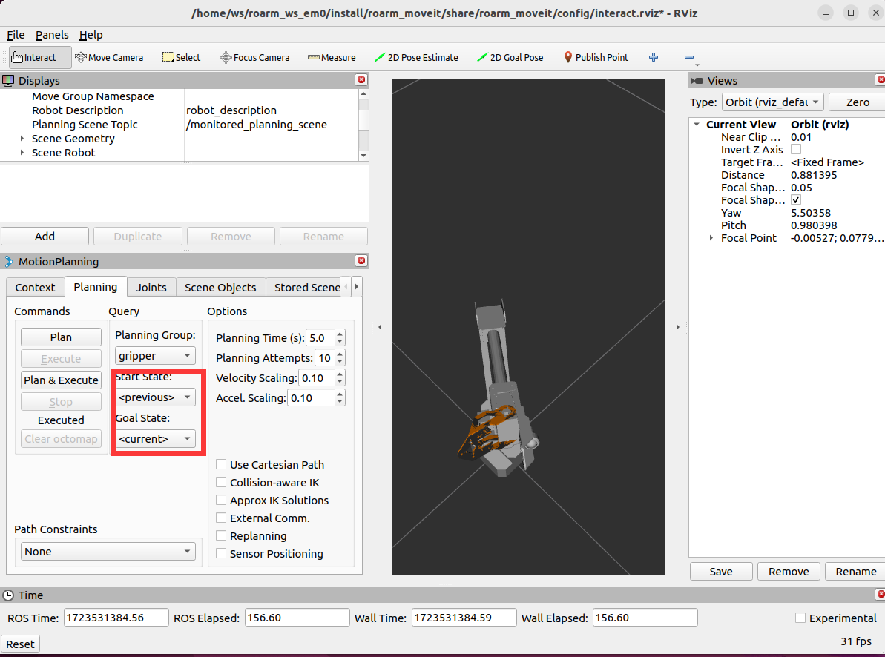
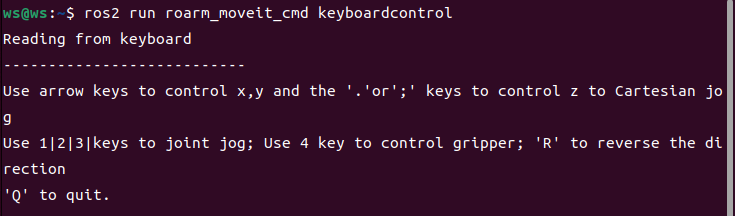
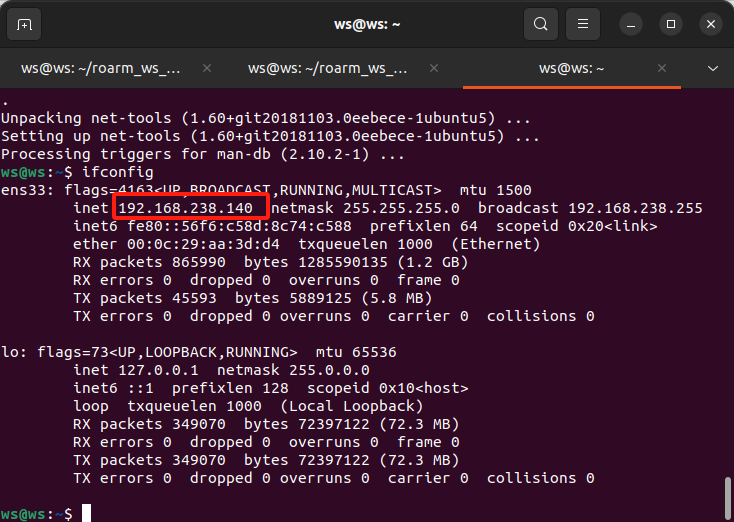
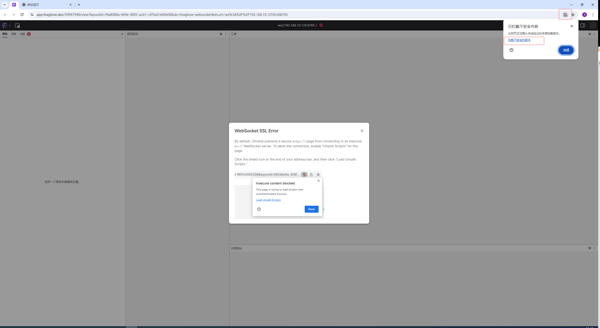
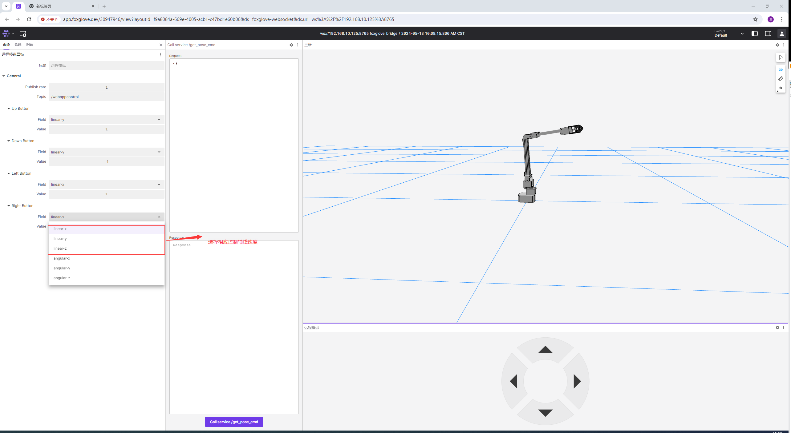
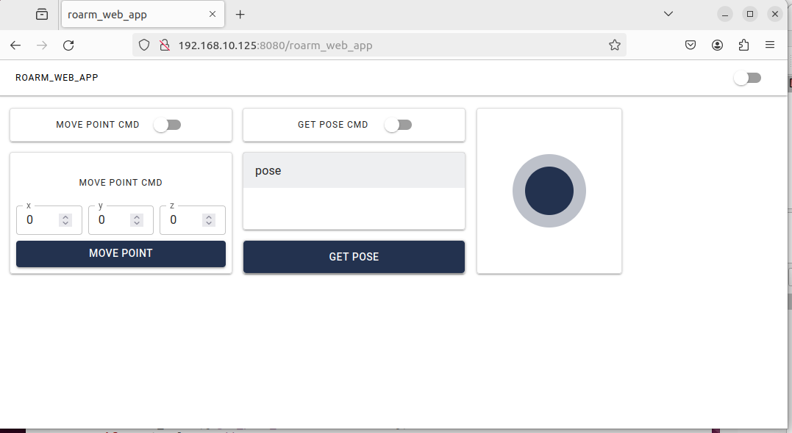
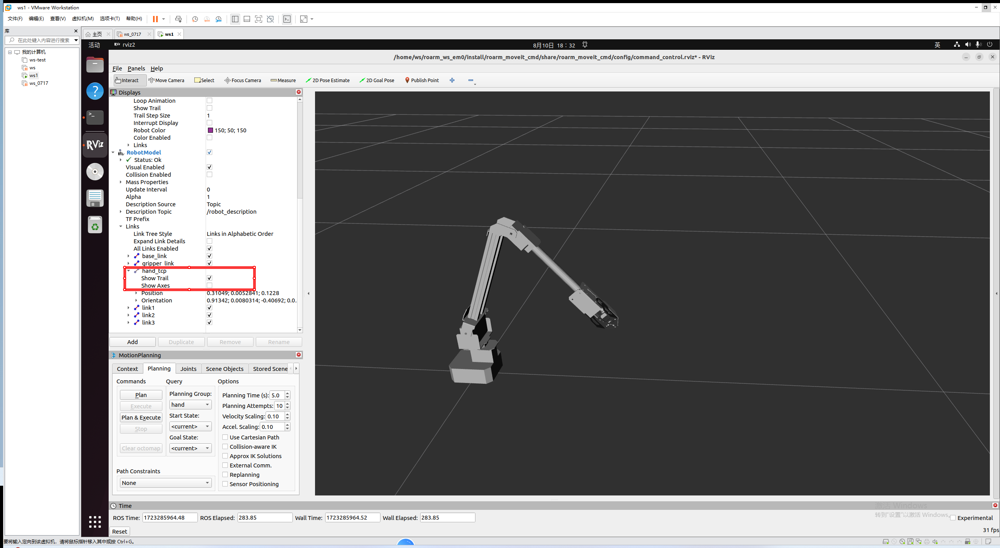

 

  

# ROS2 + Moveit2 for RoArm-M2-S

## 1 Installing ROS2 Applications for RoArm-M2-S on Ubuntu 22.04 (ROS2 Humble)
- Download the Ubuntu 22.04 image
    - Link: [Ubuntu 22.04.4 Desktop Image](https://releases.ubuntu.com/jammy/ubuntu-22.04.4-desktop-amd64.iso)
- Download and install Oracle VM VirtualBox
    - Link: [VirtualBox Downloads](https://www.virtualbox.org/wiki/Downloads)

### 1.1 Loading the Image File
- Run Oracle VM VirtualBox.
- Click on New → Enter a name → Choose a project folder (preferably on a disk with sufficient space) → Specify the virtual optical disk as the image file you just downloaded.
    - Note: Ensure to uncheck Skip Unattended Installation. Otherwise, in Oracle VM VirtualBox versions above 7.0, you might not have root permissions and might not be able to use the terminal.
- After proceeding, select the newly appeared image name on the left, click on Settings → Display → Screen, and increase the video memory if possible. If conditions allow, allocate 128 MB. Apply the settings.
- Double-click the image on the left, then select Try or Install Ubuntu.
- Install Ubuntu 22.04.

### 1.2 Downloading the Project and Installing Dependencies
Update software sources:

    sudo apt update

Upgrade the system:

    sudo apt upgrade

Install git:

    sudo apt install git

Then, clone the project from GitHub:

    git clone https://github.com/DUDULRX/roarm_ws_em0.git

Install dependencies:

    sudo apt install software-properties-common
    sudo add-apt-repository universe
    
    sudo apt update && sudo apt install curl -y
    sudo curl -sSL https://raw.githubusercontent.com/ros/rosdistro/master/ros.key -o /usr/share/keyrings/ros-archive-keyring.gpg
    
    echo "deb [arch=$(dpkg --print-architecture) signed-by=/usr/share/keyrings/ros-archive-keyring.gpg] http://packages.ros.org/ros2/ubuntu $(. /etc/os-release && echo $UBUNTU_CODENAME) main" | sudo tee /etc/apt/sources.list.d/ros2.list > /dev/null
    
    sudo apt update
    sudo apt upgrade
    
    sudo apt install ros-humble-desktop
    
    sudo apt install ros-dev-tools
    
    sudo apt install net-tools
    sudo apt install ros-humble-moveit-*
    sudo apt install ros-humble-foxglove-bridge
    sudo apt autoremove ros-humble-moveit-servo-*

Add ROS2 to the source
Source the setup script:

    echo "source /opt/ros/humble/setup.bash" >> ~/.bashrc
    source ~/.bashrc

Install Python3 libraries:

    sudo apt install python3-pip
    cd ~/roarm_ws_em0
    python3 -m pip install -r requirements.txt

Initial compilation:

    cd ~/roarm_ws_em0
    sudo chmod +x build_first.sh
    . build_first.sh

Contents of build_first.sh (automatically run by the script; no manual execution required). This step may take a while to complete.

    cd ~/roarm_ws_em0
    colcon build
    echo "source ~/roarm_ws_em0/install/setup.bash" >> ~/.bashrc
    source ~/.bashrc 

At this point, you can use the tutorial content. Some packages may generate stderr output during the compilation process, which can be ignored.

### 1.3 Subsequent Compilations and Usage
Every time you make changes to a package's code, you need to recompile it before using it.

Regular compilation:

    cd ~/roarm_ws_em0
    . build_common.sh

Contents of build_common.sh (automatically run by the script; no manual execution required):

    cd ~/roarm_ws_em0
    colcon build
    colcon build --packages-select roarm_web_app launch_api ros2web_app ros2web_widgets ros2web ros2web_example_py --symlink-install 
    source install/setup.bash 

Compiling only roarm-web-app:

    cd ~/roarm_ws_em0
    . build_roarm_web_app.sh

Contents of build_roarm_web_app.sh (automatically run by the script; no manual execution required):

    cd ~/roarm_ws_em0
    colcon build --packages-select roarm_web_app launch_api ros2web_app ros2web_widgets ros2web ros2web_example_py --symlink-install

## 2 roarm_ws_em0 Package Overview
roarm_ws_em0 is a workspace containing multiple ROS2 packages, each serving a specific purpose in the operation and control of robotic arms. Below is an overview of each package and its main functionalities:

1. roarm_main
Main Functionalities:

Acts as the central package for managing and coordinating the overall operations of the robotic arm system.

2. roarm_driver
Driver for Real Robot:

Responsible for interfacing with and controlling the physical robotic arm hardware.

3. roarm_description
Robotic Arm Model:

Contains the URDF (Unified Robot Description Format) files and other model descriptions necessary for simulating and visualizing the robotic arm.

4. roarm_moveit
Kinematic Configuration:

Provides configurations for MoveIt, a motion planning framework, including setup files and parameters required for the kinematic control of the robotic arm.

5. roarm_moveit_ikfast_plugins
IKFast Kinematics Solver:

Implements the IKFast kinematics solver, which is used for efficient and fast inverse kinematics calculations.

6. roarm_moveit_cmd
Control Commands:

Includes scripts and nodes for sending control commands to the robotic arm, allowing for movement and task execution.

7. roarm_web_app
Web-based Control:

Provides a web application interface for controlling the robotic arm remotely via a web browser.

8. moveit_servo
Joystick Control:

Enables control of the robotic arm using a joystick or gamepad, allowing for intuitive manual operation.

9. roarm_else (Dependency for roarm_web_app)
Additional Dependencies:

Contains various dependencies and supplementary functionalities required by the roarm_web_app package.

10. launch_api
Launch Management:

Provides API functionalities for managing and launching various nodes and packages within the ROS2 ecosystem.

11. ros2web_app
Web Application for ROS2:

Facilitates the development and deployment of web applications that interact with ROS2 nodes and services.

12. ros2web-ros2/ros2web
ROS2 Web Interface:

Implements the core web interface functionalities that allow for seamless integration and communication between web applications and ROS2.

13. ros2web-ros2/ros2web_interfaces
ROS2 Web Interfaces:

Defines the necessary interfaces and messages used for communication between the web applications and ROS2 nodes.

## 3 Controlling a Physical Robotic Arm with Driver Nodes
### 3.1 Connect the Robotic Arm and Identify the Serial Port
Before connecting the robotic arm via USB, check the current serial devices on your Ubuntu system:

    ls /dev/tty*

Then, connect the robotic arm. Be sure to connect to the Type-C port in the middle of the PCB board (the edge Type-C port is for radar connection and does not communicate with the ESP32). Click on `Devices → USB → select the device with "CP210x"` in its name from the Oracle VM VirtualBox menu. If prompted that the device cannot be mounted, you may need to shut down the virtual machine.

Ensure your computer (Windows) can detect this USB device.

Next, in the VM settings, locate the USB device section, check Enable USB Controller, select `USB 3.0 (xHCI)` Controller, and add a USB filter for the device with "CP210x" in its name. Click OK.

Run the VM again, and from the top menu, click Devices → USB → ensure there is a checkmark next to the device with "CP2102N USB".

Check the serial devices again:

    ls /dev/tty*

You should now see a new device like `/dev/ttyUSB0` at the end of the list. If not, disconnect and reconnect the robotic arm.

### 3.2 Change the Serial Port Device
If the detected serial port device is `/dev/ttyUSB0`, you can skip this section and proceed to **3.3** Running the Robotic Arm Driver Node.

If the serial port device is not `/dev/ttyUSB0`, you need to update the serial port device name in the Python script `~/roarm_ws_em0/src/roarm_main/roarm_driver/roarm_driver/roarm_driver.py` by changing line 15:

    serial_port = "/dev/ttyUSB0"

to your actual serial port device name.

Then, recompile the ROS2 packages in the terminal:

    cd ~/roarm_ws_em0/
    colcon build
    source install/setup.bash

### 3.3 Running the Robotic Arm Driver Node
According to the ROS2 official documentation, it is not recommended to run ROS2 nodes in the same terminal where you compile the packages. Open a new terminal window using `Ctrl + Alt + T`.

Grant serial port permissions and run the ROS2 robotic arm driver node:

Grant read and write permissions to the serial device using the following command (replace `/dev/ttyUSB0` with your actual device path):

    sudo chmod 666 /dev/ttyUSB0

Run the driver node:

    ros2 run roarm_driver roarm_driver

### 3.4 Viewing the Model Joints
Open a new terminal window with `Ctrl + Alt + T`.

Run Rviz2 to display the robotic arm model and the joint control panel:

Rviz2 is a visualization tool in ROS2 that can display and debug robot models, sensor data, path planning, and more. Using Rviz2, you can visually monitor the robot's movements and current position. Additionally, Rviz2 provides tools such as 3D views, timelines, and parameter adjustments to better understand the robot's behavior.

Note: When you run the following command, the robot's URDF in Rviz2 will publish the joint angles to the driver node. The driver node will convert these angles into JSON control commands for the robotic arm, causing it to move (the arm will be vertical). Ensure there are no fragile items around the robotic arm and keep children away.

    ros2 launch roarm_description display.launch.py

If you do not see the joint control panel, click the gear icon on the left to bring it to the forefront.

You can control the movement of each joint by dragging the sliders in the control panel. This is the simplest and most basic method to control the robotic arm in ROS2.

You can control the LED on the gripper of the robot arm through the following command,data is an integer, the range is [0-255].

    ros2 topic pub /led_ctrl std_msgs/msg/Float32 {"data: 0"} -1

### 3.5 Manipulating the View in Rviz2
In Rviz2, you can adjust the view of the robot model using the mouse:

Left-click and drag to move the view horizontally.
Right-click and drag to change the viewing direction and angle.
Scroll the mouse wheel to zoom in or out.
Press and hold the middle mouse button (wheel) and drag to move vertically.
These operations allow you to view the robot model from any angle and distance.

## 4 Interacting with the Robotic Arm End Effector Using MoveIt2
### 4.1 Introduction to MoveIt2
MoveIt2 is an open-source software for robotic motion planning, manipulation, and control. It provides a simple user interface to help developers handle complex motion planning problems.

MoveIt2 supports various algorithms and strategies, including motion planning, execution, monitoring, kinematics, and collision detection. Its powerful features make it widely used in industrial, research, and educational fields.

MoveIt2 operates within the ROS2 (Robot Operating System 2) environment and integrates seamlessly with other ROS2 tools and libraries, significantly improving the efficiency and convenience of robot development.

In this tutorial, we will use MoveIt2 to control the robotic arm's movements. By dragging the end effector of the robotic arm, MoveIt2 can automatically calculate the motion path and control the actual movement of the robotic arm through the driver nodes.

### 4.2 Running the MoveIt2 Demo
In the terminal window where Rviz2 is currently running, press `Ctrl + C` to close the Rviz2 session.

Run the following command to execute the robotic arm MoveIt2 demo. This demo includes inverse kinematics solving, allowing you to interact with the robotic arm by dragging the end effector:

    ros2 launch roarm_moveit interact.launch.py 

When controlling the gripper, it should be selected as in the picture

Note: After executing this command, the robotic arm will move, with the forearm extending forward and parallel to the ground.

If the robotic arm is not displayed in Rviz2, click on the `Fixed Frame` option in the Displays window after launching Rviz2. Beside `map`, a triangle icon will appear; click on this icon, select `base_link`, and press Enter to confirm.

Next, click on `Add` in the bottom left corner, then select `MotionPlanning` and click `OK`. This will display the robotic arm model. You can refer to the **3.5 Manipulating the View in Rviz2** section to change the view angle.

Now, you can change the posture of the robotic arm by dragging the sphere or XYZ axes at the end effector. This dragging will not immediately move the physical robotic arm. To execute the planned movements on the real robotic arm, you need to click the `Plan & Execute` button in the Planning tab on the right side of the screen.

## 5 Controlling the Robotic Arm with Keyboard and Gamepad
This chapter explains how to control the robotic arm using either keyboard keys or a gamepad. Note that the RoArm-M2-S does not come with a gamepad by default; you can purchase an Xbox Bluetooth gamepad and connect it to your computer for control.

Before running this section, you need to close the previously running MoveIt2 demo, but keep the roarm_driver node running, as it is necessary for controlling the physical robotic arm.

Enter the following command to start the nodes related to controlling the robotic arm:

    ros2 launch moveit_servo demo.launch.py

Open a new terminal and run the following command. 

    ros2 run roarm_moveit_cmd setgrippercmd

### 5.1 Keyboard Control
Open a new terminal and run the following command. This terminal window should remain active as it will receive control commands from the keyboard:

    ros2 run roarm_moveit_cmd keyboardcontrol

Keep this terminal window active and use the following keys to control the robotic arm:

Coordinate Control:
- Arrow Key ↑: Positive X direction
- Arrow Key ↓: Negative X direction
- Arrow Key ←: Negative Y direction
- Arrow Key →: Positive Y direction
- ; Key: Positive Z direction
- . Key: Negative Z direction

Joint Control:
- 1 Key: Base joint
- 2 Key: Shoulder joint
- 3 Key: Elbow joint
- 4 Key: Gripper
- R Key: Switch direction of the above joint controls

### 5.2 Gamepad Control
After connecting the gamepad to the computer, ensure that the gamepad USB device has been successfully mounted to the virtual machine.

## 6 Controlling the Robotic Arm Using a Web Interface (Foxglove)
Note: This chapter's web application is based on components provided by Foxglove. You need to register for a Foxglove account to use it. However, in regions with restricted internet access, this website may not be accessible. If you cannot access the site, you can skip this chapter. The web applications in later chapters do not require internet access.

[Download - Foxglove](https://foxglove.dev/download)

    - Foxglove Studio: An open-source software for visualizing, debugging, and controlling your robot. It provides a user-friendly interface that allows you to interact directly with the robot's data. Foxglove Studio supports multiple data formats, including ROS messages, JSON, and CSV. Core features include data visualization, real-time and historical data viewing, layout customization, and a plugin system for adding new features and tools as needed.

Keep the terminal window running the following command from the previous chapter. If you accidentally closed it, you can start a new terminal window and run the demo again:

    ros2 launch moveit_servo demo.launch.py

Ensure the roarm_driver is still running; otherwise, you won't be able to control the physical robotic arm.

Run the web application control node in ROS2:

    ros2 run roarm_moveit_cmd webappcontrol

### 6.1 Register for a Foxglove Account and Get IP Address
Using a computer on the same local network as the virtual machine (or the computer running VirtualBox), visit this URL to register for a Foxglove account: https://app.foxglove.dev/signin.

Get the IP address of the virtual machine. Ensure the network connection in Oracle VM VirtualBox is set to Bridged Adapter (other methods can work if you understand the principles). Avoid using Network Address Translation (NAT) by default, as it may not show the IP address.

Open a new terminal and retrieve the IP address:

    ifconfig

Find the IP address under the enp0s3 device next to inet. For example, `192.168.10.175` (your IP address will likely be different). Remember your IP address.

### 6.2 Start the Foxglove Web Application
Start the Foxglove web application using the following command:

    ros2 launch foxglove_bridge foxglove_bridge_launch.xml address:=192.168.10.175

Replace the IP address above with your virtual machine's IP address.

The following steps are not performed in the virtual machine. Use a computer on the same local network (preferably the one you registered with Foxglove) and open Google Chrome. In the Foxglove user interface, click Open connection. In the Open a new connection window, enter your virtual machine's IP address, such as:

    ws://192.168.10.175:8765

In the Chrome address bar, there's a shield icon. Since Chrome blocks insecure scripts by default, you need to manually allow these scripts.

Click the window with the grid floor (named "`3D`"). On the left side, a control panel named "`3D Panel`" will appear. Click the Custom Layer option at the bottom left, then expand URDF.

URDF (Unified Robot Description Format): An XML format for describing the robot model, including links, joints, and other physical properties like friction and inertia. Widely used in ROS for 3D model visualization, collision detection, and path planning.

n the URL field, enter the following to let Foxglove directly use the URDF file:

    package://roarm_description/urdf/roarm_description_web_app.urdf

Ensure the eye icon next to `/robot_description` under Topics is turned off. 

Otherwise, it will display an incorrect URDF model (this is a known bug in Foxglove and ROS2 communication where importing URDF from topics causes erroneous rotations).

You can now view the robot model in the 3D window and adjust the view using the mouse.

### 6.3 Controlling with the Dashboard
Click the Add Panel icon at the top and add a Joystick panel. Select the Joystick window, and a control panel named "`Joystick Panel`" will appear on the left. Choose the `/webappcontrol` topic in the Topic field.

A joystick control button will appear in the Joystick window. You can adjust the layout by dragging the window.

In the Joystick Panel on the left, you can define the functions and directions (±1) for the joystick's up, down, left, and right buttons, allowing you to control the robotic arm.

Note: If the `/webappcontrol` topic does not appear, manually close the node in the virtual machine and restart it:

    ros2 run roarm_moveit_cmd webappcontrol

You can further develop other features based on the Foxglove documentation.

## 7 Web Application Based on ROS2Web_app
This chapter's web application is independent of the Foxglove introduced in the previous chapter. You can close all terminal windows except for `roarm_driver`, ensuring the `roarm_driver` node is **running** properly.

### 7.1 Introduction to the ROS2Web_app Project
ROS2Web_app is an open-source project available on GitHub. This project provides a web-based application interface, allowing users to interact with ROS2 robots via a web browser. Leveraging the convenience and ubiquity of web technologies, users can operate and control robots without needing to install special software or hardware.

Key Features of ROS2Web_app:

Display Robot Status: Shows the current status and information of the robot.
Receive and Send Control Commands: Allows users to send commands to the robot.
Real-time Video Streaming: Users can view real-time video streams from the robot.

Cross-device Compatibility: Can be accessed on any device with a modern web browser, including PCs, tablets, and smartphones.

Open-source and Customizable: The project is open-source on GitHub, enabling researchers and developers to download, modify, and distribute the code freely. This provides a powerful tool for developing and testing custom ROS2 robots.

### 7.2 Running the Web Application
To control the robotic arm using the web application, follow these steps:

Ensure the roarm_driver node is running.
Open a new terminal and start the required nodes:
Step 1: Launch the MoveIt2 Servo Node

    ros2 launch moveit_servo demo.launch.py

Step 2: Start the Web Server

    ros2 web server --no-auth

Step 3: Run the Web Application Node

    ros2 run roarm_web_app roarm_web_app

Step 4: Run the Web Application Control Node

    ros2 run roarm_moveit_cmd webappcontrol

Access the Web Application:

Use a computer on the same local network (or the computer running the virtual machine) to open Google Chrome.

In the address bar, enter the IP address of your virtual machine followed by `:8080/roarm_web_app`. For example:

    http://192.168.10.175:8080/roarm_web_app

You should see a web page with a simple interface where you can drag points to control the robotic arm within the XY plane.

### 7.3 Customization and Expansion

The provided web page implements basic functionality with simple components. The left-side components are not controlled by the launch scripts mentioned above. Users can expand and customize these components according to their specific requirements.

For further development, you can explore the following areas:

Adding New Controls: Extend the web interface with additional controls for more complex robot operations.

Integrating Sensor Data: Display real-time sensor data from the robot.
Enhancing User Interface: Improve the UI/UX to make it more intuitive and user-friendly.

Implementing Security Features: Add authentication and authorization mechanisms to secure access to the web application.

By customizing the ROS2Web_app, you can create a robust and user-friendly interface to interact with your ROS2 robots, making it easier to develop and test robotic applications.

## 8 Command Control (Invoking ROS2 Services , Actions)
In this chapter, you will learn how to control the robotic arm using command-based control by invoking ROS2 services. Close all terminal windows from the previous chapters, except for the one running roarm_driver.

Run the launch file for command control, which relies on MoveIt2 for motion planning:

    ros2 launch roarm_moveit_cmd command_control.launch.py

Note: After executing this command, the robotic arm will move, with the forearm extending forward and parallel to the horizontal plane.

If the robotic arm is not displayed in Rviz2, follow these steps:

In Rviz2, click on the Displays window.

In the Fixed Frame field, click map, which will show a triangle icon.
Click the triangle icon and select base_link, then press Enter to confirm.
Click Add in the bottom left corner, select MotionPlanning, and click OK.
You should now see the robotic arm's model. Refer to 3.5 Rviz2 View Operations to adjust the view.

You can change the robotic arm's posture by dragging the end-effector's drag ball or XYZ axis in Rviz2. However, these changes will not synchronize with the physical robotic arm until you click Plan & Execute in the Planning tab on the right.

### 8.1 Get Current Position
Open a new terminal to start the node that retrieves the current position:

    ros2 run roarm_moveit_cmd getposecmd

Open another terminal to call the service that gets the current position:

    ros2 service call /get_pose_cmd roarm_moveit/srv/GetPoseCmd

### 8.2 Move the End-Effector to a Specified Position
Start the node for motion control (which receives the target position):

    ros2 run roarm_moveit_cmd movepointcmd

Call the service to control the end-effector's position:

    ros2 service call /move_point_cmd roarm_moveit/srv/MovePointCmd "{x: 0.2, y: 0, z: 0}"

Here, x, y, and z are the coordinates of the target point in meters.

By calling this service, you can control the robotic arm to move to the target position.

### 8.3 Control the gripper to the specified radian position
Start the gripper motion control node (receive the target radian position):

    ros2 run roarm_moveit_cmd setgrippercmd

Publish data to a topic and use actions to control the radian position of the gripper:

    ros2 topic pub /gripper_cmd std_msgs/msg/Float32  "{data: 0.0}" -1

Here, the data is the coordinates of the target point of the gripper, in radians.

By invoking this service, you can control the position of the robotic arm gripper to move the target radian.

### 8.4 Draw a Circle at a Fixed Height
In Rviz2, click Add, add RobotModel, and in the RobotModel tab, find Description Topic to view the trajectory of the end-effector hand_tcp.

Start the node to draw a circle:

    ros2 run roarm_moveit_cmd movecirclecmd

Call the service to make the robotic arm draw a circle at the specified position:

    ros2 service call /move_circle_cmd roarm_moveit/srv/MoveCircleCmd "{x: 0.2, y: 0, z: 0, radius: 0.1}"

The x, y, and z parameters specify the center of the circle, and radius specifies the radius of the circle in meters.

By calling this service, you can control the robotic arm to draw a circle at the desired position.