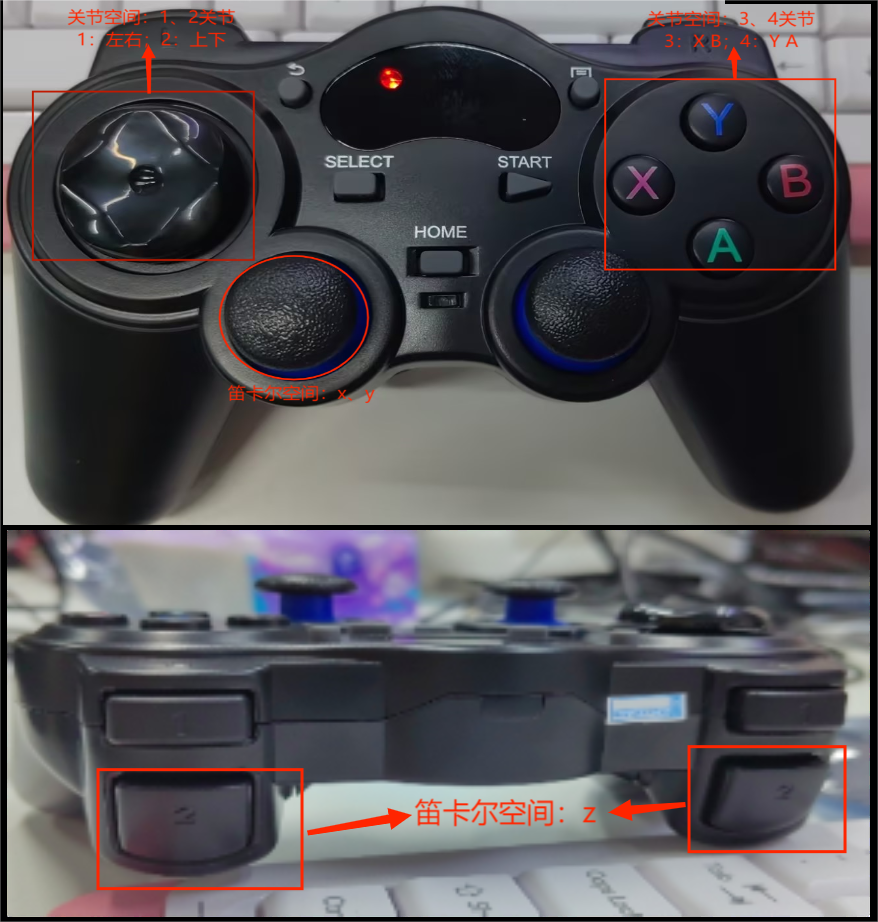
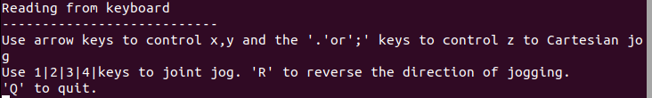
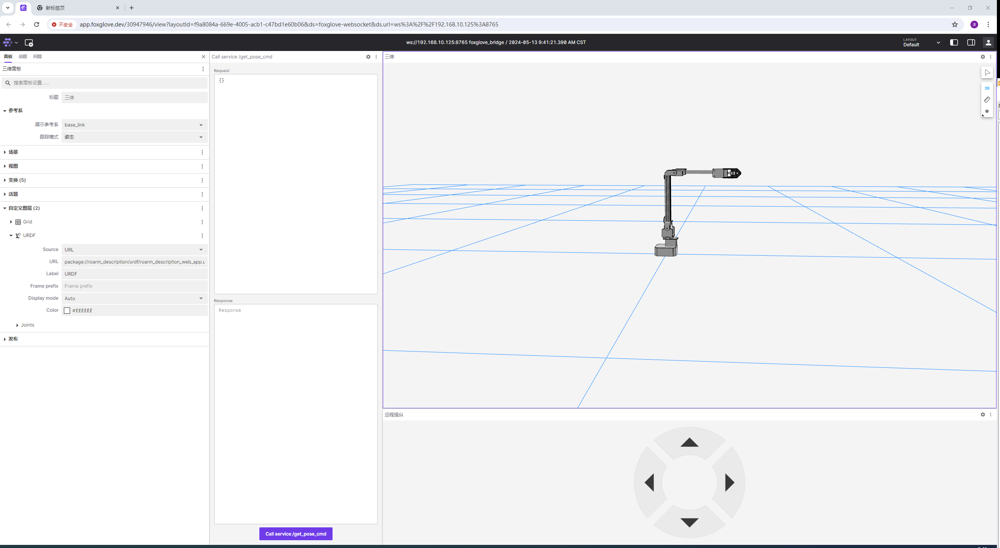
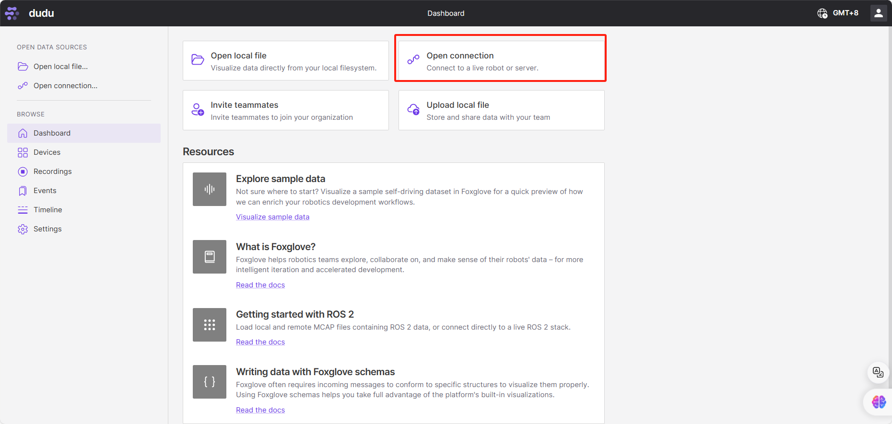
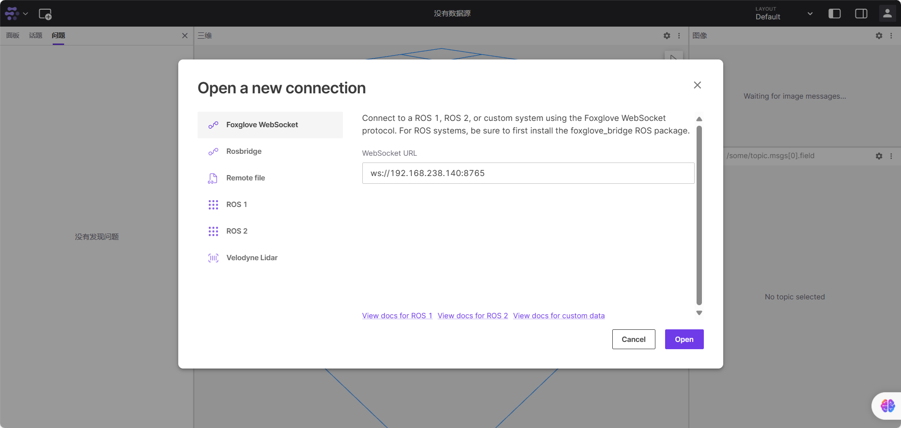
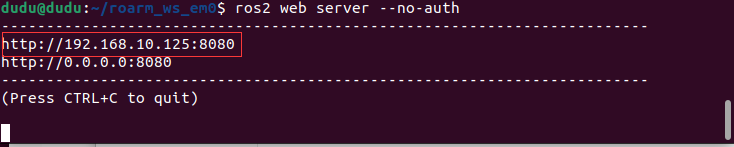
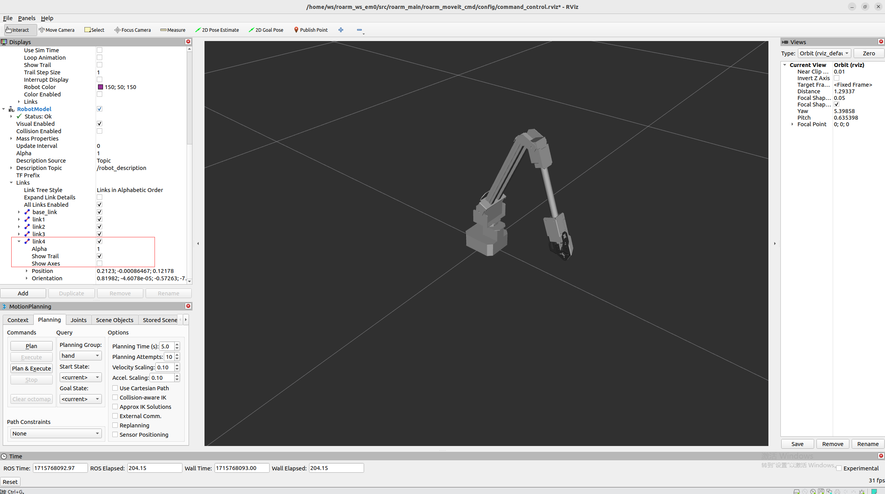
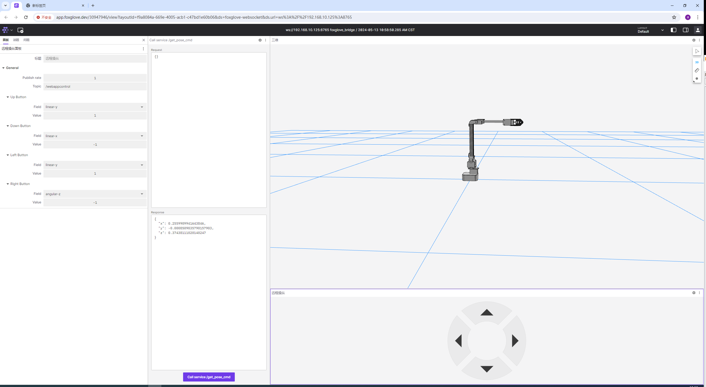

# roarm_ws_em0 工作空间说明

1.环境

- 虚拟机 软件：VMware Workstation 17Pro
- 镜像：ubuntu 22.04.4
    
    地址：
    
    ```jsx
    链接：https://pan.quark.cn/s/ba58d1dc6ad3
    提取码：DAbk
    ```
    
    密码：
    
    ```jsx
    ws
    ```
    

2.架构

- 项目：https://github.com/DUDULRX/roarm_ws_em0.git
    
    ```jsx
    git clone https://github.com/DUDULRX/roarm_ws_em0.git
    ```
    
    - 初次编译
        
        ```jsx
        cd ~/roarm_ws_em0
        . build_first.sh
        ```
        
        build_first.sh内容
        
        ```jsx
        cd ~/roarm_ws_em0
        colcon build
        echo "source ~/roarm_ws_em0/install/setup.bash" >> ~/.bashrc
        source ~/.bashrc 
        ```
        
    - 日常编译
        
        ```jsx
        cd ~/roarm_ws_em0
        . build_common.sh
        ```
        
        build_common.sh内容
        
        ```jsx
        cd ~/roarm_ws_em0
        colcon build
        colcon build --packages-select roarm_web_app launch_api ros2web_app ros2web_widgets ros2web ros2web_example_py --symlink-install 
        source install/setup.bash 
        ```
        
    - 仅修改roarm-web-app 编译
        
        ```jsx
        cd ~/roarm_ws_em0
        . build_roarm_web_app.sh
        ```
        
        build_roarm_web_app.sh内容
        
        ```jsx
        cd ~/roarm_ws_em0
        colcon build --packages-select roarm_web_app launch_api ros2web_app ros2web_widgets ros2web ros2web_example_py --symlink-install 
        ```
        
- ubuntu 软件：  net-tools、ros2 humble 、moveit2、foxglove
    
    **参照wiki安装 ros2 humble桌面版 、rosdep**
    
    apt安装 net-tools、moveit2、foxglove，卸载moveit-servo
    
    ```jsx
    sudo apt-get update 
    sudo apt-get upgrade 
    sudo apt install net-tools
    sudo apt install ros-$ROS_DISTRO-moveit-*
    sudo apt install ros-$ROS_DISTRO-foxglove-bridge
    sudo apt autoremove ros-$ROS_DISTRO-moveit-servo-*
    ```
    
- python3 库：pyserial、aiohttp、ujson、aiortc、av、opencv-python
    
    国内
    
    ```jsx
    cd ~/roarm_ws_em0
    python3 -m pip install -r requirements.txt -i https://pypi.tuna.tsinghua.edu.cn/simple
    ```
    
    国外
    
    ```jsx
    cd ~/roarm_ws_em0
    python3 -m pip install -r requirements.txt 

    ```
    
    roarm_web_app_requirements.txt 内容
    
    ```jsx
    pyserial
    aiohttp
    ujson
    aiortc
    av
    opencv-python
    ```
    
- roarm_ws_em0 功能包
    
    > roarm_main 主要功能
    > 
    > 
    > > roarm_driver 驱动真实机
    > > 
    > 
    > > roarm_description 机械臂模型
    > > 
    > 
    > > roarm_moveit 运动学相关配置
    > > 
    > 
    > > roarm_moveit_ikfast_plugins 运动学求解器
    > > 
    > 
    > > roarm_moveit_cmd 控制指令
    > > 
    > 
    > > roarm_web_app web端控制
    > > 
    > 
    > > moveit_servo 手柄控制
    > > 
    
    > roarm_else ( roarm_web_app 依赖)
    > 
    > 
    > > launch_api
    > > 
    > 
    > > ros2web_app
    > > 
    > 
    > > ros2web-ros2/ros2web
    > > 
    > 
    > > ros2web-ros2/ros2web_interfaces
    > > 

3.使用

- 驱动真实机械臂
    
    插拔设备，再次输入，找到通信串口设备名
    
    ```jsx
    ls /dev/tty*
    ls /dev/tty*
    sudo chmod 777 设备名
    ```
    
    修改roarm_driver.py 
    
    文件路径：
    
    ~/用户名/roarm_ws_em0/src/roarm_main/roarm_driver/roarm_driver/roarm_driver.py
  
    

    
    重新编译，运行驱动节点
    
    ```jsx
    cd /home/ws/roarm_ws_em0/
    colcon build
    source install/setup.bash
    ros2 run roarm_driver roarm_driver
    ```
    
- 查看模型关节
    
    ```jsx
     ros2 launch roarm_description display.launch.py
    ```
    
    [](https://youtu.be/WgrSR6vae24 "")
    
- 使用拖拽交互
    
    ```jsx
    ros2 launch roarm_moveit interact.launch.py rviz_config:=/home/ws/roarm_ws_em0/src/roarm_main/roarm_moveit/config/interact.rviz
    ```
    
    [](https://youtu.be/TXtlQPufbvo "")
    
- 使用手柄、键盘控制
    
    ```jsx
    ros2 launch moveit_servo demo.launch.py
    ```
    
    - 手柄控制
        
        xbox手柄遥控器
        
        
        
    - 键盘控制
        
        ```jsx
        ros2 run roarm_moveit_cmd keyboardcontrol
        ```
        
        
        
        [](https://youtu.be/0pKDJmgqTSY "")
        
- 使用web端控制
    
    ```jsx
    ros2 launch moveit_servo demo.launch.py
    ```
    
    ```jsx
    ros2 run roarm_moveit_cmd webappcontrol
    ```
    
    - foxglove web端（推荐使用谷歌浏览器）
        
        
        
        - foxglove账号配置
            
            注册
            
            [Download - Foxglove](https://foxglove.dev/download)
            
            
            
        - 使用
            - 查看本机ip
                
                ```jsx
                ifconfig
                ```
                
                
                
            - 启动网页端
                
                ```jsx
                ros2 launch foxglove_bridge foxglove_bridge_launch.xml address:=本机ip
                ```
                
                
                
                输入并打开链接
                
                ```jsx
                 ws://本机ip:8765
                ```
                
                
                
                允许加载不安全的脚本
                
                
                
            - 方向盘控制
                
                根据移动需求，选择相应控制轴的线速度进行移动
                
                
                
                [](https://youtu.be/LAFFA8Eocok "")
                
    - roarm web端
        
        
        
        - 使用
            - 方向盘控制（仅控制x,y）
                
                ```jsx
                ros2 web server --no-auth 
                ```
                
                网页端前缀
                
                
                
                ```jsx
                ros2 run roarm_web_app roarm_web_app
                ```
                
                网页端链接
                
                ```jsx
                网页端前缀/roarm_web_app
                ```
                
                
                
                [](https://youtu.be/7DzAIUb9R6s "")
                
    
    两种web控制方式不冲突
    
    [](https://youtu.be/VyPCrrktZ2k "")
    
- 使用指令控制
    
    ```jsx
    ros2 launch roarm_moveit_cmd command_control.launch.py rviz_config:=/home/ws/roarm_ws_em0/src/roarm_main/roarm_moveit_cmd/config/command_control.rviz
    ```
    
    - 获取当前点位置
        
        启动
        
        ```jsx
        ros2 run roarm_moveit_cmd getposecmd
        ```
        
        调用
        
        ```jsx
        ros2 service call /get_pose_cmd roarm_moveit/srv/GetPoseCmd 
        ```
        
        [](https://youtu.be/5g5KuA3q5oQ "")
        
    - 运动到指定点位置
        
        启动
        
        ```jsx
        ros2 run roarm_moveit_cmd movepointcmd
        ```
        
        调用
        
        ```jsx
        ros2 service call /move_point_cmd roarm_moveit/srv/MovePointCmd {"x: 0.2,y: 0,z: 0"}
        ```
        
        [](https://youtu.be/gmcXta85clc "")
        
    - 固定z高度画圆
        
        rviz选择查看末端link4轨迹
        
        
        
        启动
        
        ```jsx
        ros2 run roarm_moveit_cmd movecirclecmd
        ```
        
        调用
        
        ```jsx
        ros2 service call /move_circle_cmd roarm_moveit/srv/MoveCircleCmd {"x: 0.2,y: 0,z: 0,radius: 0.1"}
        ```
        
        [](https://youtu.be/I8LTp57vmJs "")
        
- 综合使用
    - 启动
        
        ```jsx
        ros2 launch moveit_servo servo_control.launch.py rviz_config:=/home/ws/roarm_ws_em0/src/roarm_main/roarm_moveit/config/interact.rviz
        ```
        
        键盘控制
        
        ```jsx
        ros2 run roarm_moveit_cmd keyboardcontrol
        ```
        
        web端控制
        
        ```jsx
        ros2 run roarm_moveit_cmd webappcontrol
        ```
        
        web端启动
        
        foxglove
        
        ```jsx
        ros2 launch foxglove_bridge foxglove_bridge_launch.xml address:=本机ip
        ```
        
        roarm web
        
        ```jsx
        ros2 web server --no-auth 
        ```
        
        ```jsx
        ros2 run roarm_web_app roarm_web_app
        ```
        
    - 拖拽交互
        
        [](https://youtu.be/8A8ESAQ2PfI "")
        
    - 键盘控制
        
        [](https://youtu.be/wD9GraTuFPE "")
        
    - web端控制
        - 方向盘控制
            
            [](https://youtu.be/y8_KrJN4WX8 "")
            
        - 指令控制
            - foxglove
                
                举例：获取当前点位置
                
                ```jsx
                ros2 run roarm_moveit_cmd getposecmd 
                ```
                
                
                
                [](https://youtu.be/XAEW27lDHPg "")
                
            - roarm web
                
                [](https://youtu.be/Yx4BJSXPVV0 "")
                
    - 指令控制
        
        举例：获取当前点位置
        
        启动
        
        ```jsx
        ros2 run roarm_moveit_cmd getposecmd
        ```
        
        调用
        
        ```jsx
        ros2 service call /get_pose_cmd roarm_moveit/srv/GetPoseCmd 
        ```
        
        [](https://youtu.be/HO_XqbAsnyY "")
        
    - 手柄控制（注意 需切换launch文件）
        
        切换launch文件
        
        ```jsx
        ros2 launch moveit_servo [demo.launch.py](http://demo.launch.py/)
        ```
        
        xbox手柄遥控器
        
        
